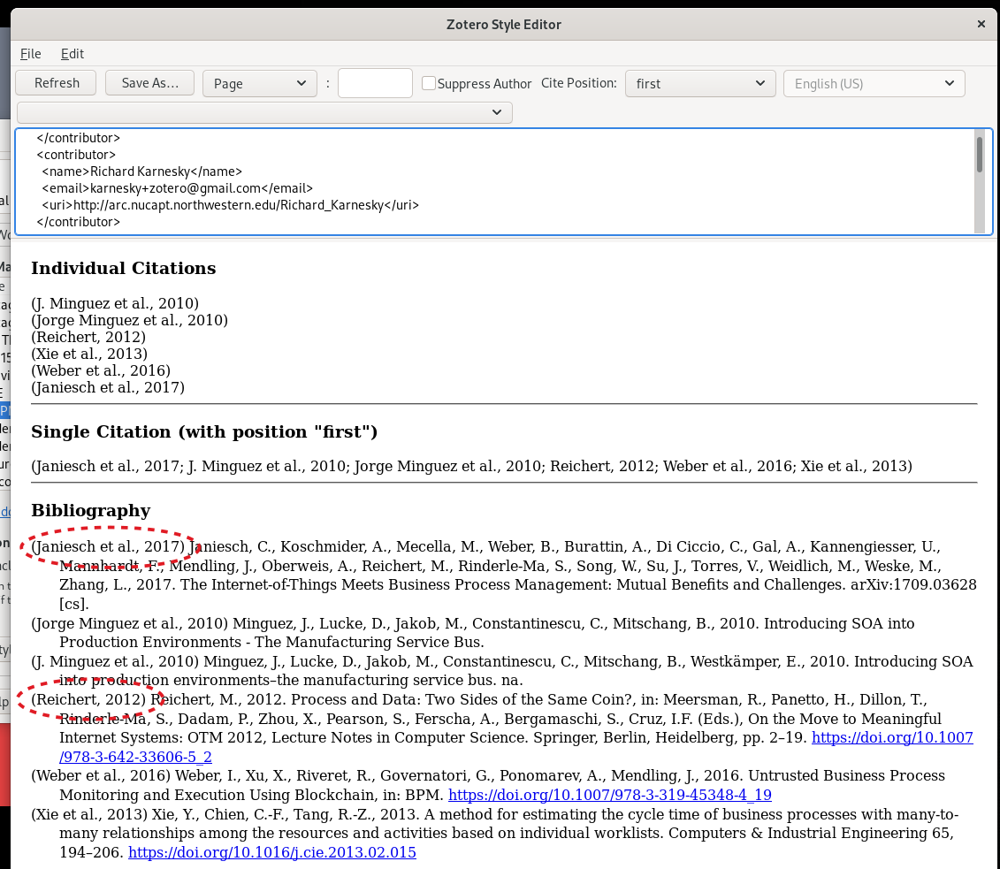
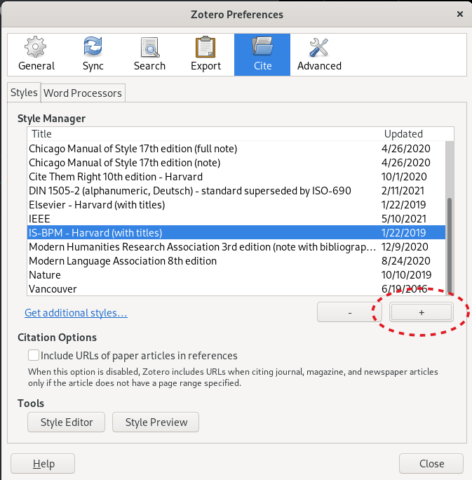

# is-bpm-harvard.csl

Citation style with labels in bibliography. Adapted from Elsevier Harvard by Juergen "eTM" Mangler.

## How Does It Look?

Compared the Elsevier Harvard the citatiations are identical, the bibliography
has labels added. The labels are identical to a first citation.

## How To Add It To Zotero

In preferences press the (+) button. To select a local csl file.
